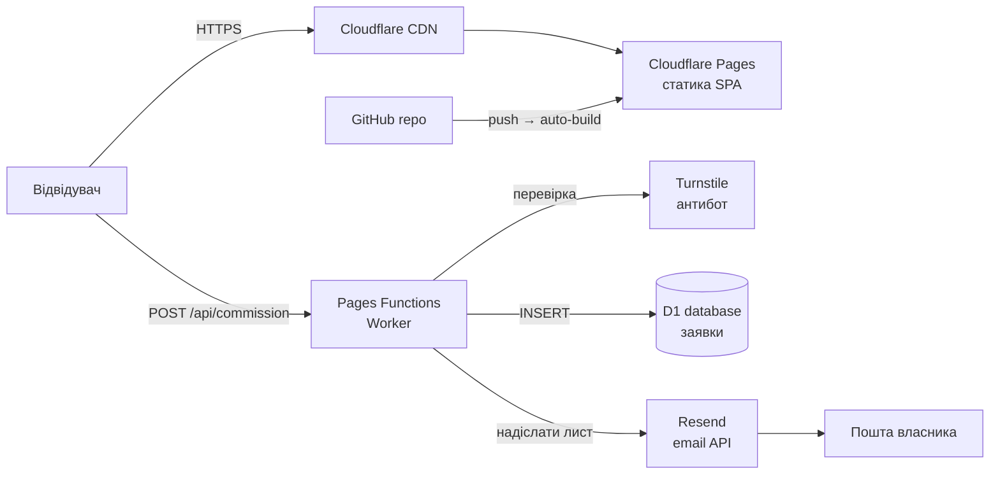

# Ronin Forge — план бекенду та деплою на Cloudflare

> Сайт — це статичний React/Vite SPA. Йому не потрібен «важкий» бекенд: потрібне
> лише **хостинг статики + один serverless-ендпоінт** для форми замовлення
> (модалка «Почати замовлення»), сховище лідів і сповіщення на email.
> Усе це вкладається в **безкоштовні тарифи Cloudflare** (+ ~$10/рік за домен).

---

## 1. Архітектура (огляд)



**Компоненти Cloudflare:**

| Сервіс | Роль | Тариф |
|---|---|---|
| **Pages** | Хостинг зібраного SPA (`dist/`) + глобальний CDN + SSL | Free (безлім. статика) |
| **Pages Functions** | Serverless API (`/api/commission`) — приймає форму | Free (100k запитів/день) |
| **D1** | SQLite-БД — зберігає заявки на кування | Free (5 ГБ, 5 млн читань/день) |
| **Turnstile** | Захист форми від ботів (заміна CAPTCHA) | Free |
| **R2** *(опційно)* | Об'єктне сховище для фото/відео замість бандлу | Free (10 ГБ) |
| **Email Routing** *(опц.)* | Пересилання `hello@roninforge.jp` на особисту пошту | Free |
| **Resend** *(зовнішній)* | Надсилання листів-сповіщень (Cloudflare сам не шле) | Free (3000/міс) |

**Домен:** Cloudflare Registrar (~$10/рік) **або** наявний домен, у якого міняєш
nameservers на Cloudflare.

---

## 2. Що саме треба з боку бекенду

Функціонал сайту зараз:
- ✅ Статичний контент (hero, каталог, секції) — **бекенд не потрібен**, лишається у `data.js`.
- ⚠️ **Форма замовлення** (`OrderModal`) — зараз заглушка (`onSubmit` просто закриває). **Це єдине, що потребує бекенду.**
- ℹ️ Контакти/футер — статичні.

Отже мінімальний бекенд = **1 ендпоінт** `POST /api/commission`, який:
1. приймає `{ name, email, message, katana, turnstileToken }`;
2. перевіряє Turnstile-токен (антибот);
3. валідує дані (email, довжина, обов'язкові поля);
4. пише заявку в D1;
5. шле email-сповіщення власнику через Resend;
6. повертає `{ ok: true }`.

---

## 3. Структура проєкту після додавання бекенду

```
katana-forge/
├── functions/
│   └── api/
│       └── commission.js      # Pages Function (POST-ендпоінт)
├── schema.sql                 # схема D1
├── wrangler.toml              # конфіг Cloudflare (біндинги D1, змінні)
├── src/                       # існуючий фронтенд
│   └── App.jsx                # OrderModal → підключити fetch + Turnstile
├── public/
└── package.json
```

---

## 4. База даних (D1)

**`schema.sql`:**

```sql
CREATE TABLE IF NOT EXISTS commissions (
  id         INTEGER PRIMARY KEY AUTOINCREMENT,
  name       TEXT    NOT NULL,
  email      TEXT    NOT NULL,
  message    TEXT,
  katana     TEXT,                       -- назва обраної катани (або NULL)
  lang       TEXT,                       -- 'en' | 'uk'
  ip         TEXT,
  user_agent TEXT,
  created_at TEXT    NOT NULL DEFAULT (datetime('now'))
);
CREATE INDEX IF NOT EXISTS idx_commissions_created ON commissions(created_at);
```

Створення:
```bash
npx wrangler d1 create ronin-forge
npx wrangler d1 execute ronin-forge --file=./schema.sql --remote
```

---

## 5. Ендпоінт (Pages Function)

**`functions/api/commission.js`:**

```js
export async function onRequestPost({ request, env }) {
  const cors = {
    'Access-Control-Allow-Origin': env.SITE_ORIGIN || '*',
    'Content-Type': 'application/json',
  };
  try {
    const body = await request.json();
    const { name, email, message, katana, lang, turnstileToken } = body;

    // 1) валідація
    if (!name || !email || !/^[^@]+@[^@]+\.[^@]+$/.test(email)) {
      return json({ ok: false, error: 'invalid_input' }, 400, cors);
    }

    // 2) Turnstile (антибот)
    const ok = await verifyTurnstile(turnstileToken, env.TURNSTILE_SECRET,
      request.headers.get('CF-Connecting-IP'));
    if (!ok) return json({ ok: false, error: 'bot_check_failed' }, 403, cors);

    // 3) запис у D1
    await env.DB.prepare(
      `INSERT INTO commissions (name,email,message,katana,lang,ip,user_agent)
       VALUES (?,?,?,?,?,?,?)`
    ).bind(
      name.slice(0,120), email.slice(0,160), (message||'').slice(0,2000),
      katana||null, lang||null,
      request.headers.get('CF-Connecting-IP'),
      request.headers.get('User-Agent')
    ).run();

    // 4) email власнику через Resend
    await fetch('https://api.resend.com/emails', {
      method: 'POST',
      headers: { Authorization: `Bearer ${env.RESEND_API_KEY}`,
                 'Content-Type': 'application/json' },
      body: JSON.stringify({
        from: 'Ronin Forge <orders@roninforge.jp>',
        to: [env.OWNER_EMAIL],
        reply_to: email,
        subject: `Нова заявка: ${katana || 'консультація'} — ${name}`,
        text: `Ім'я: ${name}\nEmail: ${email}\nКатана: ${katana||'—'}\n\n${message||''}`,
      }),
    });

    return json({ ok: true }, 200, cors);
  } catch (e) {
    return json({ ok: false, error: 'server_error' }, 500, cors);
  }
}

// preflight
export const onRequestOptions = () => new Response(null, { status: 204, headers: {
  'Access-Control-Allow-Origin': '*',
  'Access-Control-Allow-Methods': 'POST, OPTIONS',
  'Access-Control-Allow-Headers': 'Content-Type',
}});

async function verifyTurnstile(token, secret, ip) {
  if (!token) return false;
  const r = await fetch('https://challenges.cloudflare.com/turnstile/v0/siteverify', {
    method: 'POST',
    headers: { 'Content-Type': 'application/x-www-form-urlencoded' },
    body: new URLSearchParams({ secret, response: token, remoteip: ip || '' }),
  });
  const d = await r.json();
  return d.success === true;
}

const json = (obj, status, headers) =>
  new Response(JSON.stringify(obj), { status, headers });
```

---

## 6. Зміни у фронтенді (`src/App.jsx` → `OrderModal`)

1. Додати Turnstile-віджет (скрипт `https://challenges.cloudflare.com/turnstile/v0/api.js`)
   і `data-sitekey` (публічний ключ).
2. `onSubmit` замість `onClose()` робить:

```jsx
const res = await fetch('/api/commission', {
  method: 'POST',
  headers: { 'Content-Type': 'application/json' },
  body: JSON.stringify({
    name, email, message,
    katana: item?.name || null,
    lang,
    turnstileToken: window.turnstile?.getResponse(),
  }),
});
const data = await res.json();
// показати стан: успіх / помилка, потім закрити
```

3. Додати стани `sending / success / error` для UX (спінер, подяка, повтор).
4. Тексти станів — у `i18n.js` (EN/UK), як і решта.

---

## 7. Конфіг Cloudflare (`wrangler.toml`)

```toml
name = "ronin-forge"
compatibility_date = "2024-11-01"
pages_build_output_dir = "dist"

[[d1_databases]]
binding = "DB"
database_name = "ronin-forge"
database_id = "<id з wrangler d1 create>"

[vars]
SITE_ORIGIN = "https://roninforge.jp"
```

**Секрети** (НЕ в git — через дашборд Pages → Settings → Environment variables, або `wrangler pages secret put`):
- `TURNSTILE_SECRET` — приватний ключ Turnstile
- `RESEND_API_KEY` — ключ Resend
- `OWNER_EMAIL` — куди слати заявки
- Публічний `VITE_TURNSTILE_SITEKEY` — можна у звичайні env (він не секретний)

---

## 8. Домен і DNS

**Варіант А — купити домен у Cloudflare** (найпростіше): Registrar → купівля →
DNS уже в Cloudflare → у Pages додати Custom domain `roninforge.jp` → готово, SSL авто.

**Варіант Б — домен уже є в іншого реєстратора:**
1. Додати сайт у Cloudflare → отримати 2 nameservers.
2. У реєстратора домену замінити NS на Cloudflare-івські.
3. Дочекатись активації (до кількох годин).
4. Pages → Custom domains → `roninforge.jp` + `www` (CNAME авто).
5. SSL/TLS: режим **Full (strict)**, увімкнути **Always Use HTTPS**.

**Email на домені (опц.):** Cloudflare **Email Routing** — безкоштовне
*вхідне* пересилання `hello@roninforge.jp` → твоя Gmail. Для *вихідних*
листів із форми потрібен Resend + верифікація домену (SPF/DKIM записи, які
Resend дасть додати в Cloudflare DNS).

---

## 9. Деплой (покроково)

```bash
# 1. репозиторій
git init && git add . && git commit -m "Ronin Forge"
# запушити на GitHub

# 2. Cloudflare Pages: Connect to Git → обрати repo
#    Build command:  npm run build
#    Output dir:     dist
#    Framework:      Vite

# 3. D1
npx wrangler d1 create ronin-forge
npx wrangler d1 execute ronin-forge --file=./schema.sql --remote
#    → у Pages Settings прив'язати D1 binding "DB"

# 4. Секрети у Pages → Settings → Environment variables
#    TURNSTILE_SECRET, RESEND_API_KEY, OWNER_EMAIL

# 5. Turnstile: dash.cloudflare.com → Turnstile → Add site
#    → скопіювати Site key (фронт) і Secret key (бекенд)

# 6. Resend: resend.com → додати домен → додати DNS-записи в Cloudflare
#    → створити API key

# 7. Custom domain у Pages → roninforge.jp
```

Кожен `git push` → авто-білд і деплой. Прев'ю-деплой на кожен PR.

---

## 10. Безпека (чекліст)

- [x] **Turnstile** на формі (антибот/спам)
- [x] **Rate limiting** — Cloudflare WAF Rate Limiting Rules на `/api/*` (напр. 5 req/min/IP)
- [x] Валідація й обрізання довжини всіх полів на сервері
- [x] Секрети лише в env Cloudflare, не в git (додати `.dev.vars` у `.gitignore`)
- [x] CORS обмежити своїм доменом (`SITE_ORIGIN`)
- [x] SSL Full (strict) + Always HTTPS + HSTS
- [x] Не логувати повний вміст листів; зберігати мінімум персональних даних
- [ ] (Опц.) honeypot-поле у формі як додатковий фільтр

---

## 11. Вартість

| Стаття | Ціна |
|---|---|
| Cloudflare Pages / Functions / D1 / Turnstile | **$0** (free tier з запасом) |
| Resend (до 3000 листів/міс) | **$0** |
| Домен `.jp`/`.com` | **~$10–40/рік** |
| **Разом** | **≈ ціна лише домену** |

---

## 12. Дорожня карта (на майбутнє, за потреби)

1. **Адмінка лідів** — окрема захищена сторінка `/admin` (Cloudflare Access) + Function, що читає з D1. Або просто дивитись через `wrangler d1 execute ... "SELECT..."`.
2. **Онлайн-оплата** — якщо продавати напряму: **Stripe Checkout** (Stripe сам хостить сторінку оплати; Worker створює session). Cloudflare добре з цим працює.
3. **Кошик / кілька товарів** — стан на фронті + позиції в D1.
4. **CMS для контенту** — винести каталог із `data.js` у D1/KV, редагувати без деплою.
5. **Аналітика** — Cloudflare Web Analytics (безкоштовна, без кукі).
6. **Медіа на R2** — перенести `hero.mp4` і фото карток у R2 + CDN (розвантажить бандл, зручніше оновлювати).

---

### Підсумок
Для запуску потрібно реально небагато: **Pages (статика) + одна Function для форми + D1 + Turnstile + Resend**. Це майже повністю безкоштовно і повністю в екосистемі Cloudflare під твоїм доменом.
